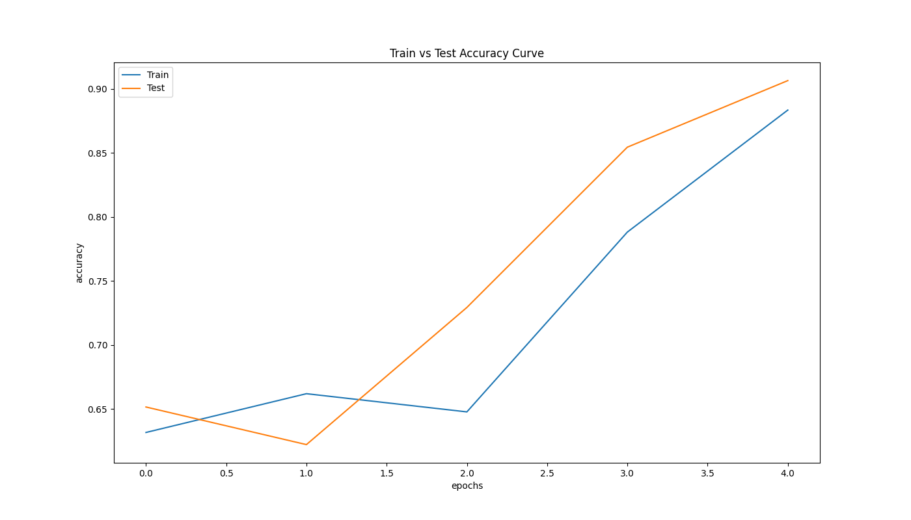
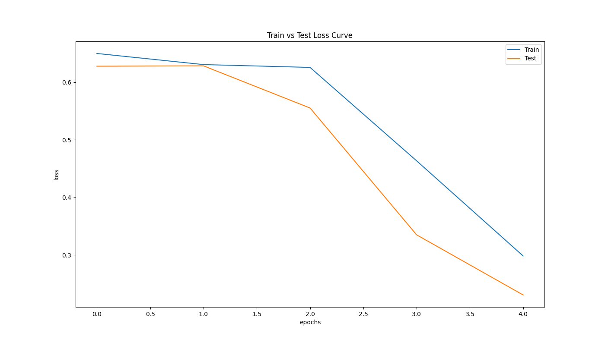
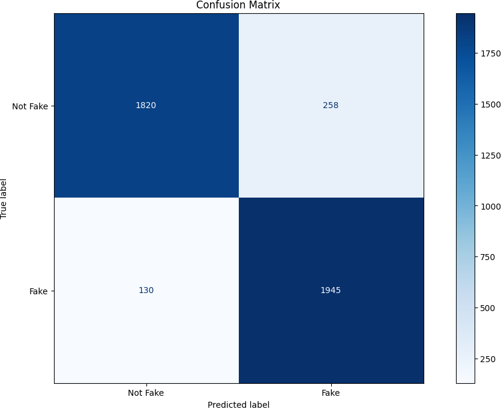

## Fabricated Information Recognition with Embedding Techniques

#### Required for Execution
1. Python 3.11.4 or higher (add python to path)
2. Kaggle account with kaggle api on your main drive in .kaggle folder
3. VS Code

#### Steps
1. Install Python 3.11.4 or higher version and add python to path while setting up.
2. Download zip file and open extracted folder in vs code.
3. now create virtual environment
   * Way 1 = Pressing `CTRL+SHIFT+P` in VS code ==> type `Select Python Interpreter` ==> choose `.venv` ==> choose python version ==> click `requirements.txt` option ==> "OK"
   * Way 2 = Open command prompt in VS Code ==> type `python -m venv .venv` ==> Hit enter.
4. After successfully creating virtual environment activate it from command prompt using `.venv/Scripts/activate`.
5. Type `python -m pip install -r requirements.txt`
6. Open `model.ipynb` and run each cell (Before running select python kernel by clicking `Select Python Kernel` on top right corner of VS Code.
7. Confirm a new file with name `*.pkl` and `*.keras` or `*.h5` appears in root folder.
8. Now in command prompt run  `streamlit run app.py`
9. You will now see browser open with your app running.
10. Enter data and start testing.
11. To stop app after using, in command prompt press `CTRL+C` and server will stop.
12. To re-run just use `streamlit run app.py`

#### On New systems follow all the steps.

## Output

